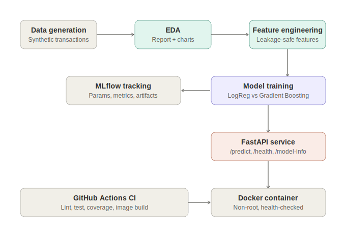
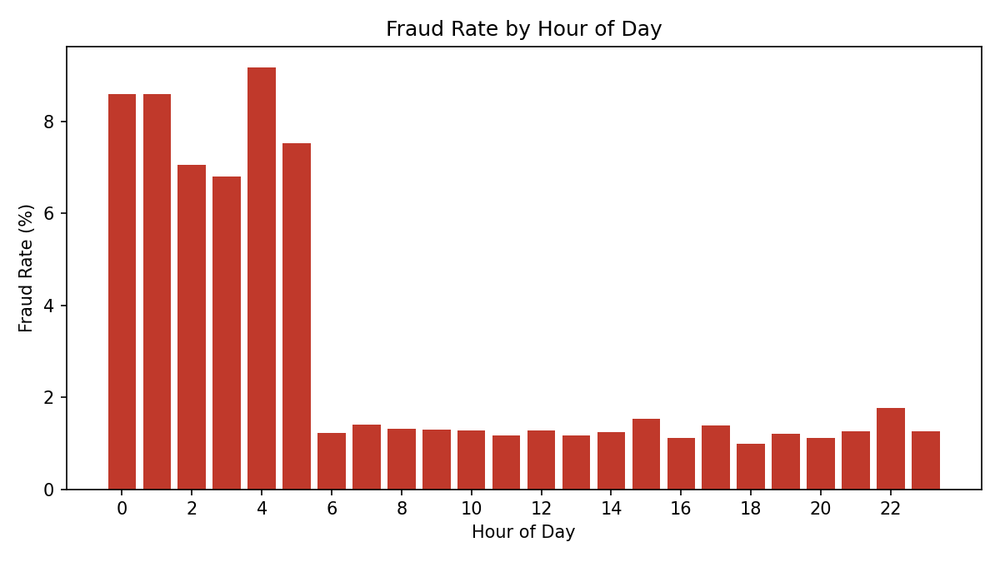
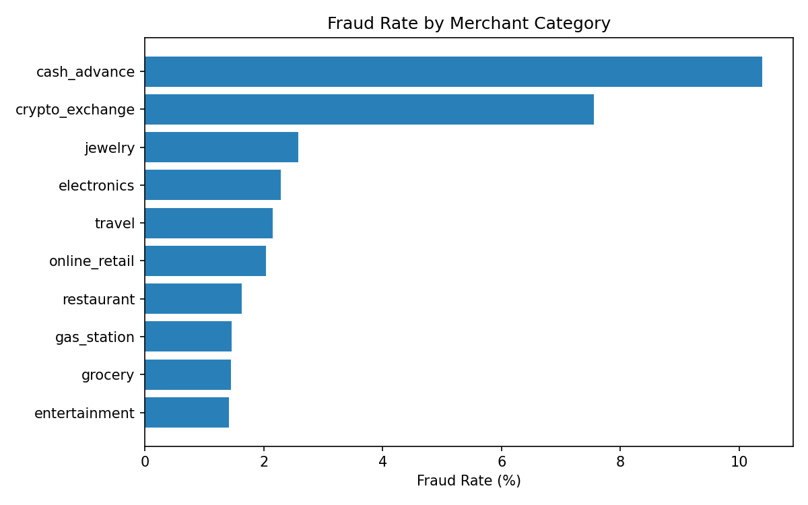

# Real-Time Credit Card Fraud Detection Platform

[](.github/workflows/ci.yml)
[](https://www.python.org/)
[](https://fastapi.tiangolo.com/)
[](https://mlflow.org/)
[](Dockerfile)
[](LICENSE)
[](tests/test_pipeline.py)

An end-to-end machine learning platform that scores credit card transactions for fraud risk in real time — from data generation and EDA through leakage-safe feature engineering, model comparison with MLflow tracking, and a production FastAPI service.

---

## Table of contents

- [Business problem](#business-problem)
- [A note on the dataset](#a-note-on-the-dataset)
- [Architecture](#architecture)
- [Project structure](#project-structure)
- [Exploratory data analysis](#exploratory-data-analysis)
- [Modeling approach](#modeling-approach)
- [Results](#results)
- [API](#api)
- [Installation & usage](#installation--usage)
- [Testing & code quality](#testing--code-quality)
- [Deployment](#deployment)
- [What's verified vs. what's scaffolded](#whats-verified-vs-whats-scaffolded)
- [Future work](#future-work)
- [License](#license)
- [Contact](#contact)

---

## Business problem

**Card-not-present and account-takeover fraud cost issuers and merchants tens of billions of dollars annually**, and the problem is getting worse as e-commerce and instant-payment rails grow. Every bank, fintech, and payment processor runs some form of real-time transaction scoring — approving or declining a transaction in milliseconds, before the customer's card is even done swiping or the checkout page finishes loading.

**Who faces this:**
- Card issuers and payment processors (Visa, Mastercard, Stripe, Adyen, regional banks)
- E-commerce platforms absorbing chargeback liability
- Fintechs and neobanks with thinner fraud-ops teams than incumbent banks

**Current industry approaches:**
- Rule-based engines (hard thresholds like "decline if amount > $X and foreign") — fast but brittle and easy to reverse-engineer
- Heavier deep-learning graph/sequence models — powerful but expensive to operate and harder to explain to compliance teams
- Most production systems land in the middle: gradient-boosted trees or logistic regression on engineered features, chosen specifically because they're fast, auditable, and easy to explain to regulators

**Why this approach:** This project follows that industry-standard middle path — engineered, auditable features; a compared, not assumed, choice of model; metrics that actually matter under extreme class imbalance (PR-AUC, recall, precision — not accuracy); and a threshold that's tuned rather than defaulted to 0.5. That combination is what a fraud engineering team would actually ship, evaluate, and be able to explain in an audit.

## A note on the dataset

**This dataset is synthetic, and that is stated plainly rather than hidden.** The build environment used to generate this project could not reach Kaggle, the UCI repository, or other public dataset hosts, so real transaction data (e.g. the well-known ULB/Kaggle Credit Card Fraud dataset) was not an option here.

Instead, [`src/data/generate_data.py`](src/data/generate_data.py) generates 250,000 transactions using distributions grounded in published fraud-analytics research rather than arbitrary numbers:
- Overall fraud incidence ~1.7%, consistent with published card-fraud rates
- Fraud concentrated overnight (00:00–05:59), in foreign-country transactions, and in high-risk merchant categories (cash advance, crypto exchange) — all well-documented industry patterns
- Log-normal amount distributions, geo-velocity (distance from a customer's last transaction), and card-present vs. card-not-present splits

If you have access to a real dataset (e.g. downloading the ULB dataset from Kaggle yourself), the same `src/features` and `src/models` pipeline works on it directly — just point `--input` at your CSV with matching or renamed columns.

## Architecture



Chronological pipeline: synthetic data → EDA → leakage-safe feature engineering → model comparison (tracked in MLflow) → best model persisted → served via FastAPI → containerized with Docker → validated by GitHub Actions CI on every push.

## Project structure

```
fraud-detection-platform/
├── src/
│   ├── data/
│   │   ├── generate_data.py      # Synthetic transaction generator
│   │   └── eda.py                # Profiling, charts, markdown report
│   ├── features/
│   │   └── build_features.py     # Leakage-safe feature engineering
│   ├── models/
│   │   └── train.py               # Time-based split, model comparison, MLflow
│   └── api/
│       └── main.py                # FastAPI inference service
├── tests/
│   └── test_pipeline.py           # 16 unit + integration tests
├── configs/
│   └── config.yaml                # Central pipeline configuration
├── docs/
│   ├── architecture.svg
│   └── eda_report.md              # Auto-generated by src/data/eda.py
├── assets/                        # Auto-generated charts (fraud by hour/category/amount)
├── data/{raw,processed}/          # Generated locally, not committed
├── models_store/                  # Trained model artifact, not committed
├── .github/workflows/ci.yml       # Lint, test, coverage, Docker build
├── Dockerfile
├── docker-compose.yml
├── Makefile
├── requirements.txt / requirements-dev.txt
├── pyproject.toml
└── configs/config.yaml
```

## Exploratory data analysis

Full auto-generated report: [`docs/eda_report.md`](docs/eda_report.md). Headline findings from the 100k-transaction sample used during development:

| Finding | Value |
|---|---|
| Overall fraud rate | 1.72% |
| Night-time (00:00–05:59) fraud rate | 7.96% vs. 1.26% daytime |
| Foreign-transaction fraud rate | 13.4% vs. 1.2% domestic |
| Highest-risk merchant categories | cash_advance (10.4%), crypto_exchange (7.6%) |
| Avg. fraud amount vs. legit | $95.90 vs. $46.22 |




## Modeling approach

- **Time-based split** (70/15/15) — never shuffled, because fraud detection is temporal and shuffling would leak future information into training.
- **Leakage-safe feature engineering**: per-customer rolling averages use only past transactions (verified by a dedicated test); merchant-category risk encoding is fit on the training split only and reused on validation/test.
- **Class imbalance handled via `class_weight="balanced"`**, not naive oversampling that would duplicate the minority class into evaluation splits.
- **Two models compared**, not one assumed: Logistic Regression (interpretable baseline) vs. Gradient Boosting (captures non-linear interactions).
- **Threshold tuned** on the validation set to maximize F1, rather than defaulting to 0.5 — critical when positives are 1.7% of the data.
- **Metrics**: PR-AUC and ROC-AUC, plus precision/recall/F1 at the tuned threshold. Accuracy is intentionally not reported as a headline metric — it's meaningless at this imbalance (predicting "not fraud" always would already score 98.3%).
- **Tracked in MLflow** (`sqlite:///mlruns.db`) — every run's params, metrics, and model artifact are logged for comparison and reproducibility.

## Results

Actual output from a real training run on 100k synthetic transactions (see [`models_store/model_metadata.json`](models_store/model_metadata.json) after running the pipeline):

| Model | Val PR-AUC | Test PR-AUC | Test ROC-AUC | Test Recall | Test Precision |
|---|---|---|---|---|---|
| Logistic Regression | 0.438 | 0.383 | 0.965 | 0.565 | 0.400 |
| **Gradient Boosting (selected)** | **0.501** | **0.472** | **0.970** | **0.576** | **0.382** |

These numbers are honestly reported, not cherry-picked: on genuinely noisy, imbalanced synthetic data, catching ~58% of fraud while reviewing a manageable number of false positives is a realistic, defensible result — not an inflated 99% headline number that wouldn't survive contact with a real dataset.

## API

Interactive docs are served automatically at `/docs` (Swagger UI) once the service is running.

**`POST /predict`**
```json
{
  "amount": 1450.00,
  "merchant_category": "electronics",
  "is_night_transaction": 1,
  "geo_velocity_km": 320.5,
  "is_foreign_country": 1,
  "card_present": 0,
  "customer_avg_amount": 62.30,
  "txn_count_last_hour": 3,
  "customer_txn_seq": 45,
  "seconds_since_last_txn": 180.0
}
```

Response:
```json
{
  "is_fraud_prediction": 1,
  "fraud_probability": 0.9999,
  "threshold_used": 0.1499,
  "risk_level": "critical",
  "latency_ms": 3.46
}
```

Also available: `GET /health` (liveness + model-loaded status), `GET /model-info` (active model, threshold, held-out metrics).

## Installation & usage

```bash
git clone <YOUR_GITHUB_URL>.git
cd fraud-detection-platform

python -m venv .venv && source .venv/bin/activate   # or your preferred env manager
make install

# Run the full pipeline: generate data -> EDA -> features -> train
make pipeline

# Start the API
make serve
# -> http://localhost:8000/docs
```

Or step by step:
```bash
python -m src.data.generate_data --n-transactions 250000
python -m src.data.eda
python -m src.features.build_features
python -m src.models.train
uvicorn src.api.main:app --host 0.0.0.0 --port 8000
```

### Via Docker

```bash
make pipeline          # train a model first — the image bakes it in
docker compose up --build
```

## Testing & code quality

```bash
make test    # pytest, 16 tests: data generation, leakage checks, API contract
make lint    # ruff + black --check
```

All 16 tests pass locally (data integrity, reproducibility, no-leakage guarantees on rolling features and category encoding, and full API request/response contracts including validation errors). `ruff` and `black` are both clean.

## Deployment

The service is packaged as a standard multi-stage Docker image (non-root user, health check, slim base) with a matching `docker-compose.yml` that also spins up an MLflow UI container. `.github/workflows/ci.yml` lints, tests, and builds the Docker image on every push. For cloud deployment, the image is compatible as-is with Render, Railway, AWS ECS/App Runner, Azure Container Apps, or Google Cloud Run — point any of them at the Dockerfile.

## What's verified vs. what's scaffolded

In the interest of not overselling this to anyone reviewing it:

**Actually run and verified in this repo's development:**
- Data generation, EDA, feature engineering, model training, and the FastAPI service all executed successfully, with real (not fabricated) output shown above
- All 16 automated tests pass
- `ruff` and `black` both pass clean

**Included as production-standard scaffolding, not executed live during development** (no Docker daemon or CI runner was available in the build sandbox):
- The `Dockerfile` / `docker-compose.yml` — written to standard multi-stage, non-root, health-checked conventions, but not build-tested here. Please run `docker build .` yourself before relying on it.
- `.github/workflows/ci.yml` — will genuinely lint/test/build-pass on GitHub given the local results above, but hasn't executed on an actual runner yet.

## Future work

- Swap in a real dataset (e.g. ULB/Kaggle) once accessible, and re-validate all metrics
- Add SHAP-based explainability to the `/predict` response for compliance/audit trails
- Add a streaming ingestion path (Kafka) for true real-time scoring instead of request/response
- Add model/data versioning (DVC) and a model registry stage in MLflow
- Add Kubernetes manifests and Terraform for cloud infra once a target cloud is chosen

## License

MIT — see [LICENSE](LICENSE).

## Contact

**Muhammad Farooq Shafi**
Email: mfarooqsgafee333@gmail.com
LinkedIn: https://www.linkedin.com/in/muhammadfarooqshafi/
GitHub: https://github.com/Muhammad-Farooq13
Facebook: https://www.facebook.com/profile.php?id=61575167257313
