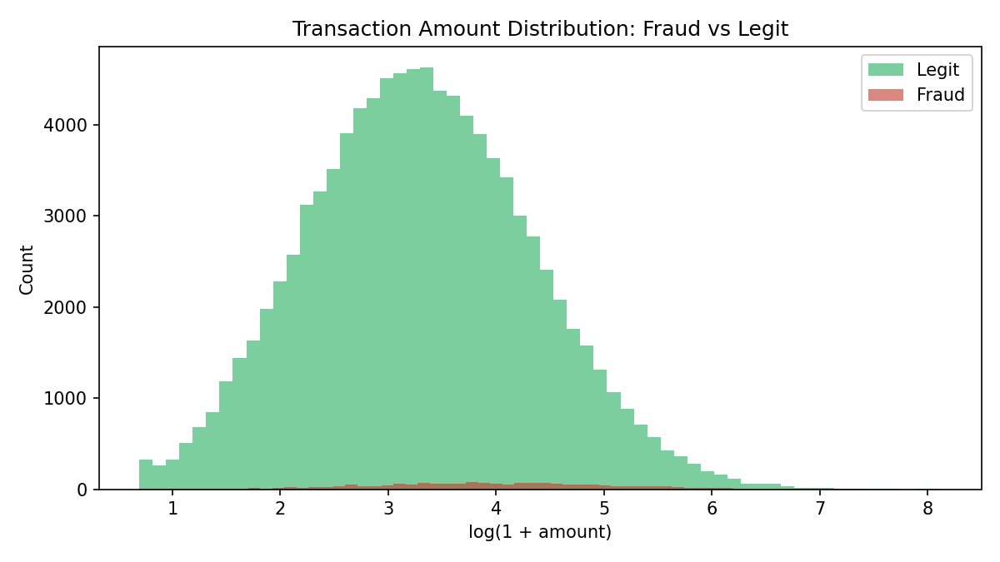

# Exploratory Data Analysis Report

> Auto-generated by `src/data/eda.py`. Dataset is synthetic (see data provenance note in `src/data/generate_data.py`) but modeled on real-world fraud analytics distributions.

## Dataset Overview
- Rows: **100,000**
- Columns: **13**
- Missing values: **0**
- Duplicate transaction IDs: **0**
- Overall fraud rate: **1.72%** (1,720 fraud / 98,280 legit)

## Key Findings
1. **Class imbalance is severe** — only 1.72% of transactions are fraudulent, meaning accuracy is a misleading metric; the modeling stage uses PR-AUC, recall, and F1 instead.
2. **Night-time transactions are riskier**: 7.959% fraud rate overnight vs. 1.257% during the day.
3. **Foreign transactions carry far higher risk**: 13.375% vs 1.216% domestic.
4. **Amount patterns differ**: fraudulent transactions average $95.9 vs $46.22 for legitimate ones.
5. **Merchant category is a strong signal** — see `fraud_rate_by_merchant_category` below and `assets/fraud_by_category.png`.

## Fraud Rate by Merchant Category
| Category | Fraud Rate |
|---|---|
| cash_advance | 10.387% |
| crypto_exchange | 7.558% |
| jewelry | 2.581% |
| electronics | 2.288% |
| travel | 2.154% |
| online_retail | 2.037% |
| restaurant | 1.624% |
| gas_station | 1.453% |
| grocery | 1.449% |
| entertainment | 1.413% |

## Charts

## Data Quality Checks
- No missing values: PASS
- No duplicate transaction IDs: PASS
